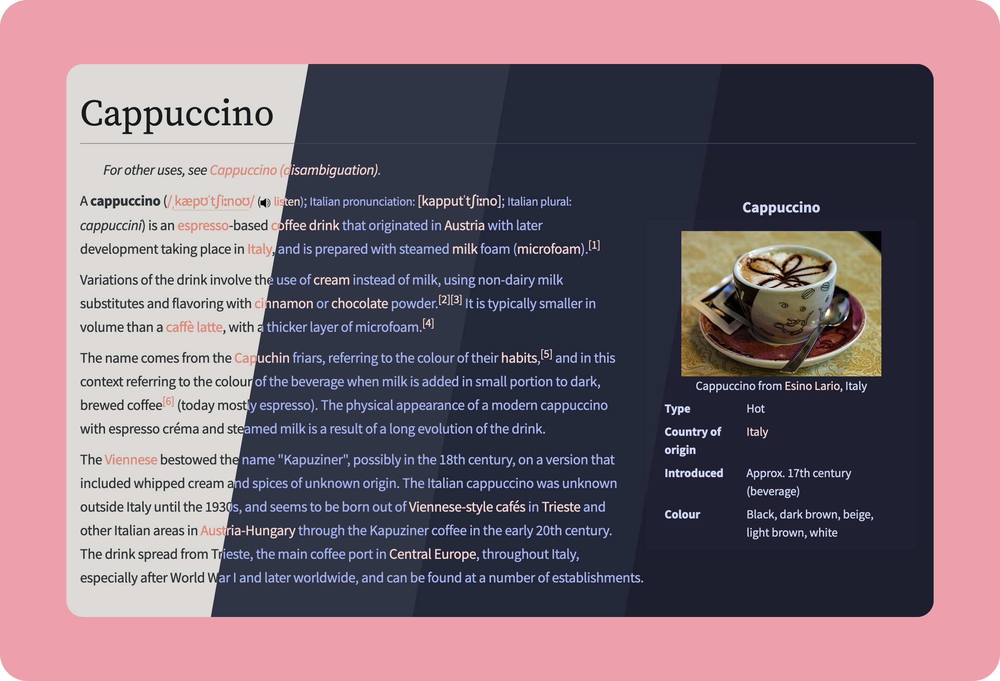

<h3 align="center">
	 
	
	Catppuccin for <a href="https://github.com/darkreader/darkreader">Dark Reader</a>
	
</h3>

    
    
    

## Usage

- Go to `Dark Reader → Theme for all websites → See all options -> Colors`.
- Open your desired flavor in the table below. Copy and paste values into respecive fields.
  - You will have to change the "Selection" setting from `Automatic` to `Custom`.
- Done! There is no apply or save button.

🌻 Latte

<table>
<tr>
<th></th>
<th></th>
</tr>
<tr>
<td>Background</td>
<td>#eff1f5</td>
</tr>
<tr>
<td>Text</td>
<td>#4c4f69</td>
</tr>
<tr>
<td>Selection</td>
<td>#acb0be</td>
</tr>
</table>

🪴 Frappé

<table>
<tr>
<th></th>
<th></th>
</tr>
<tr>
<td>Background</td>
<td>#303446</td>
</tr>
<tr>
<td>Text</td>
<td>#c6d0f5</td>
</tr>
<tr>
<td>Selection</td>
<td>#626880</td>
</tr>
</table>

🌺 Macchiato

<table>
<tr>
<th></th>
<th></th>
</tr>
<tr>
<td>Background</td>
<td>#24273a</td>
</tr>
<tr>
<td>Text</td>
<td>#cad3f5</td>
</tr>
<tr>
<td>Selection</td>
<td>#5b6078</td>
</tr>
</table>

🌿 Mocha

<table>
<tr>
<th></th>
<th></th>
</tr>
<tr>
<td>Background</td>
<td>#1e1e2e</td>
</tr>
<tr>
<td>Text</td>
<td>#cdd6f4</td>
</tr>
<tr>
<td>Selection</td>
<td>#585b70</td>
</tr>
</table>

## 💝 Thanks to

- [Sanjay Pavan](https://github.com/WitherCubes)

&nbsp;

Copyright &copy; 2021-present <a href="https://github.com/catppuccin" target="_blank">Catppuccin Org</a>

