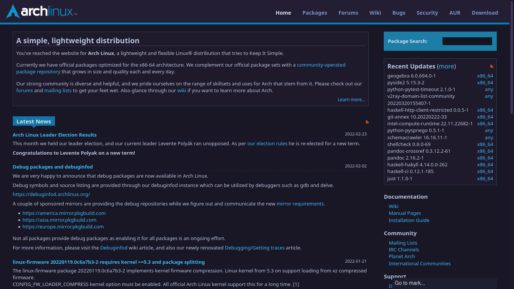
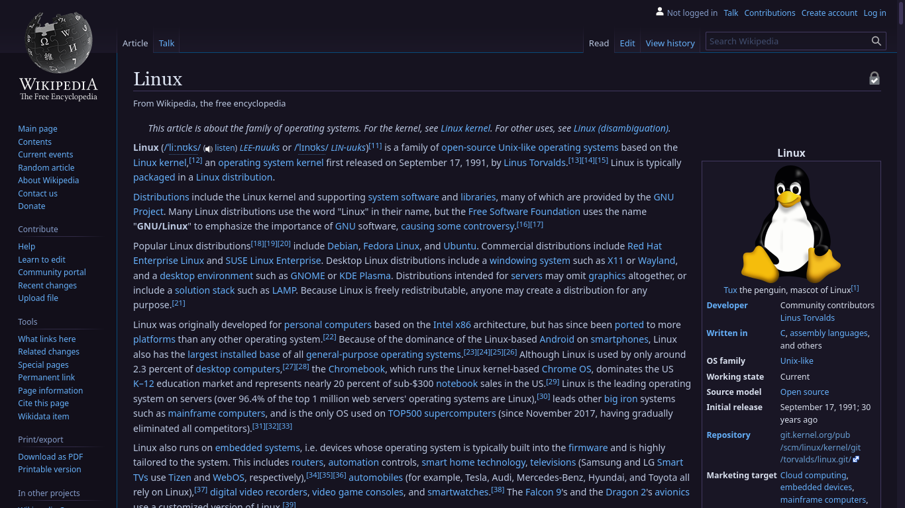
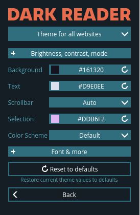

<h3 align="center">
	 
	
	Catppuccin for Dark Reader
	
</h3>

    
    
    

## Usage

1. Go to `Dark Reader → Dev tools → Preview new design → Apply`.
2. Reopen Dark Reader, select dynamic mode and click `See all Options`.
3. Click `Colors` and set the values according to the screenshot below.

## 💝 Thanks to

- [Sanjay Pavan](https://github.com/WitherCubes)

&nbsp;

Copyright &copy; 2020-present <a href="https://github.com/catppuccin" target="_blank">Catppuccin Org</a>

